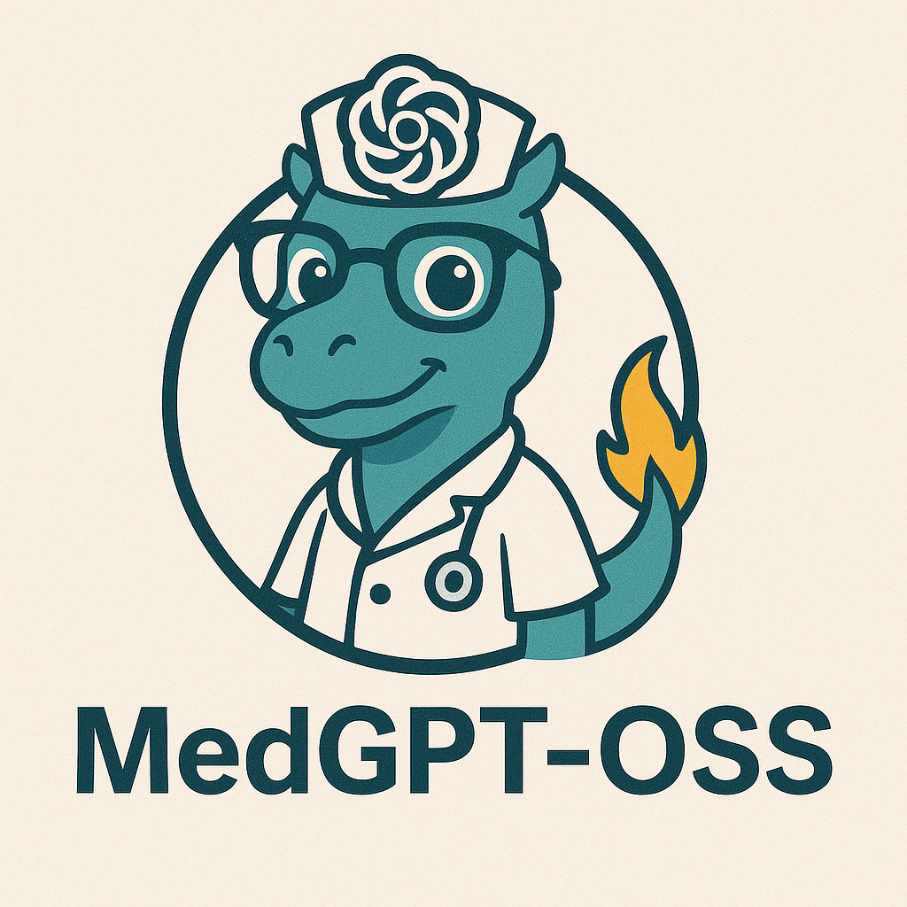
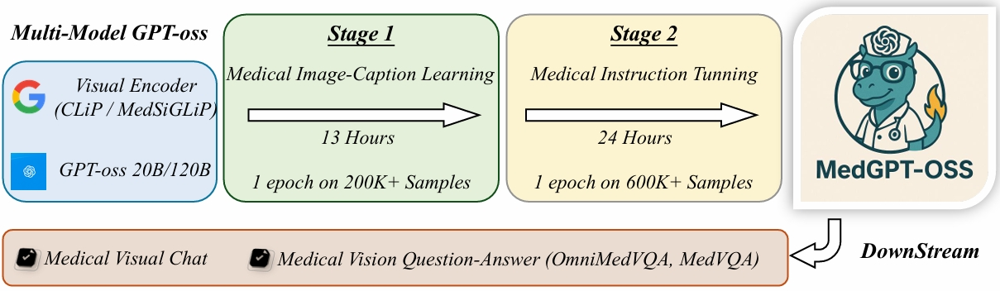

# MedGPT-OSS: Training a General-Purpose Vision-Language Model for Biomedicine

*Visual instruction tuning towards building vision-GPT-oss models in the biomedicine space.*


<p align="center">
     <br>
 
  *Generated by  <a href="[https://chatgpt.com/]/">GPT-4o</a>.*
 
</p>


## Release

- [August 13, 2025] 🔥 We released **MedGPT-OSS: Training a General-Purpose Vision-Language Model for Biomedicine**, a step towards building vision-GPT-oss models in the biomedicine space.

<p align="center">
     <br>
 
  *MedGPT-oss was built by adopting GPT-oss as the underlying language model, upon which we integrated a multimodal architecture (Clip or MedSiglip as Visual Encoder) and subsequently performed medical-domain training through a curriculum learning strategy, starting with medical image caption alignment and followed by comprehensive instruction tuning.*
</p>

## Evaluation Results

| Model                              |  OmniMedVQA  |
|------------------------------------|--------|
| LLaVA-Med                          | 29.88  |
| MedVInT                            | 41.26  |
| MedGemma                           | 42.33  |
| **MedGPT-OSS (CLIP + GPT-oss 20B)**   | **51.49**  |
| **MedGPT-OSS (CLIP + GPT-oss 120B)**   | Coming Soon  |


[](https://creativecommons.org/licenses/by-nc/4.0/deed.en)
**Usage and License Notices**: The data, code, and model checkpoints are intended and licensed for research use only. They are also subject to additional restrictions dictated by the Terms of Use: GPT-oss respectively. The data is made available under CC BY NC 4.0. The data, code, and model checkpoints may be used for non-commercial purposes and any models trained using the dataset should be used only for research purposes. It is expressly prohibited for models trained on this data to be used in clinical care or for any clinical decision making purposes.


## Release Plan
Checkpoint and Training Code will Coming Soon.....

## Bibtex Cite
```Shell
@misc{yuan2025medgptoss,
  title        = {MedGPT-OSS},
  author       = {Zhengqing Yuan and Songlin Zhao and Kai Zhang and Peng Chen and Yonghui Wu and Lifang He and Yanfang Ye and Wei Liu and Lichao Sun},
  year         = {2025},
  publisher    = {GitHub},
  journal      = {GitHub repository},
  howpublished = {\url{https://github.com/DLYuanGod/MedGPT-OSS}}
}
```

## Related Projects

- [LLaVA-Med](https://github.com/microsoft/LLaVA-Med/tree/main)
- [GPT-oss](https://github.com/openai/gpt-oss)
